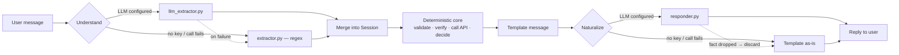

# 💳 PayWise

**A conversational AI agent that verifies a caller's identity and collects a card payment — built against a provided account-lookup / payment-processing API, with deterministic Python owning every security-sensitive decision.**

Point it at a conversation. It looks up the account, verifies who's talking to it (strict, exact-match — no fuzzy logic), shares the outstanding balance, collects card details, and processes the payment — all while handling the messy, conversational way real people actually type ("yeah my account number is ACC1001 I think", "CVV is one two three", "just clear the full amount").

---

## How it works



The LLM only ever does two things: turn a message into structured fields, and reword an already-decided message so it sounds natural. It never sees the middle box and never produces it — every validation call, retry counter, API call, and the one identity-match comparison is plain Python with zero model involvement. This is enforced structurally, not just by convention: the extraction schema has no `verified` field at all, so there's no way for a model call — however it's prompted — to hallucinate a bypass.

Both LLM calls degrade gracefully. No API key, or a call fails: same business behavior, via the regex parser / deterministic template instead — the agent is fully functional either way, just less naturally phrased. See **[DESIGN.md](DESIGN.md)** for the full architecture writeup and **[FINDINGS.md](FINDINGS.md)** for the detailed bug-by-bug history (13 real bugs found and fixed via live testing and an external audit — including the most serious one, a stray digit in an unrelated message that could once have reached a real payment as a fabricated CVV, closed by requiring CVV extraction to always be explicitly labelled).

---

## What you get

**Conversational understanding**
- Handles hedged, out-of-order, and multi-field messages ("Hi, ACC1001 here, my name is Nithin Jain, DOB 1990-05-14, I'd like to pay 200" resolves in one turn)
- Never re-asks for information already given, and acknowledges what's already captured ("Got your card number ending 0366, expiry 12/27...")
- Recognizes small talk, cancellation, and balance queries as first-class intents, not noise
- Natural, varied phrasing when an LLM key is configured — fixed, still-correct templates otherwise

**Security & verification**
- Strict exact-match identity check — full name **and** at least one of DOB / Aadhaar last-4 / pincode, no case-folding, no fuzzy matching
- DOB, Aadhaar, and pincode are never exposed to the user, at any point, for any reason
- CVV extraction requires an explicit label ("cvv 123", "security code 123") — ambiguous numeric input is never guessed at as sensitive card data
- Payment is structurally unreachable before verification succeeds — not a rule the agent remembers, a consequence of how the state chain is ordered

**Reliability**
- Every input validated locally (format, Luhn check, expiry, amount ≤ balance) before it ever reaches an API call
- Independent retry limits on account lookup, verification, and payment, each enforced and closing the conversation cleanly on exhaustion
- Raw card data is cleared from memory immediately after every payment attempt, win or lose

---

## Quick start

Requires Python 3.10+.

```bash
pip install -r requirements.txt
python cli.py
```

Or via the required interface:

```python
from agent import Agent

agent = Agent()
print(agent.next("Hi")["message"])
print(agent.next("My account ID is ACC1001")["message"])
```

No API key or account setup needed — the payment-verification API is unauthenticated, and without `GROQ_API_KEY` the agent runs fully on the deterministic path.

A minimal browser chat UI is also included:

```bash
python server.py
```

Then open `http://127.0.0.1:5000`. It's a thin Flask front door onto the exact same `Agent.next()` call the CLI uses — not a separate interface, no auth, no persistence, a demo surface.

---

## Configuration

Everything below is optional; the agent works out of the box with defaults. See `.env.example`.

| Variable | Default | Purpose |
|---|---|---|
| `API_BASE_URL` | the provided service URL | override for testing against a different environment |
| `HTTP_TIMEOUT_SECONDS` | `10` | per-request timeout |
| `HTTP_MAX_RETRIES` | `1` | automatic retries on connection/timeout errors |
| `MAX_VERIFICATION_ATTEMPTS` | `3` | identity verification retry limit |
| `MAX_ACCOUNT_LOOKUP_ATTEMPTS` | `3` | account-not-found retry limit |
| `MAX_PAYMENT_ATTEMPTS` | `3` | payment failure retry limit |
| `LOG_LEVEL` | `INFO` | logging verbosity |
| `GROQ_API_KEY` | unset | primary LLM provider for both understanding and phrasing; unset means deterministic-only |
| `LLM_MODEL` | `openai/gpt-oss-20b` | model used for the primary provider's calls |
| `LLM_BASE_URL` | Groq's endpoint | override to point the primary provider at a different OpenAI-compatible endpoint |
| `LLM_API_KEY` | unset | alternative to `GROQ_API_KEY` — use with `LLM_BASE_URL`/`LLM_MODEL` for a different provider (e.g. OpenAI itself) |
| `LLM_TIMEOUT_SECONDS` | `8` | per-call timeout for both LLM calls |
| `LLM_USES_REASONING_EFFORT` | `true` | set `false` for a standard (non-reasoning) primary model, which rejects this parameter outright |
| `OPENROUTER_API_KEY` | unset | optional **second** provider, tried only if the primary call itself fails |
| `LLM_FALLBACK_MODEL` | `nvidia/nemotron-3-nano-30b-a3b:free` | model used for the fallback provider's calls |
| `LLM_FALLBACK_API_KEY` | unset | alternative to `OPENROUTER_API_KEY` |
| `LLM_FALLBACK_BASE_URL` | OpenRouter's endpoint | override for a different fallback provider |
| `LLM_FALLBACK_SUPPORTS_FORCED_TOOL_CHOICE` | `true` | set `false` if your fallback model rejects a forced tool choice |
| `LLM_FALLBACK_USES_REASONING_EFFORT` | `true` | same as the primary setting, kept separate since primary/fallback can differ |

---

## Testing & evaluation

```bash
python -m pytest tests/ -v
```

**126 tests**, fully offline — both APIs mocked, both LLM paths force-disabled by an autouse fixture, so the suite behaves identically regardless of whether a key is set. Covers validators, verification, extraction, response phrasing, and full multi-turn agent flows.

```bash
python evals/evaluation.py
```

**38 scripted conversations against the real live payment API** (not mocked) — checks the final outcome, the actual `session.action_log` tool-call sequence, and specific session field values, then prints the metrics the assignment asks for (success rate, verification accuracy, tool-call correctness, failure-recovery rate, and more) to `evals/results.json`. Currently 38/38 against the deterministic path; see **[DESIGN.md](DESIGN.md#evaluation-approach)** for what each metric means.

---

## Example conversations

Card numbers below are replaced with `[card number]` — real values never appear in this repo. These use the deterministic template wording (no `GROQ_API_KEY` set), the guaranteed reproducible baseline.

### Successful payment

```
User: Hi
Agent: Hello! Please share your account ID to get started.
User: My account ID is ACC1001
Agent: Got it. Could you please confirm your full name?
User: Nithin Jain
Agent: Thanks. Could you also verify your date of birth, Aadhaar last 4 digits, or pincode?
User: DOB is 1990-05-14
Agent: Identity verified. Your outstanding balance is ₹1,250.75. How much would you like to pay today?
User: I want to pay 500
Agent: To charge ₹500.00, please share your card number, expiry (MM/YY), CVV.
User: card number [card number], expiry 12/27, cvv [cvv]
Agent: Payment successful! ₹500.00 was charged (transaction ID txn_1786627228482_qj9xmde). Thanks, Nithin Jain - have a great day!
```

<details>
<summary><strong>Verification failure → retry exhaustion</strong></summary>

```
User: ACC1001
Agent: Hello! Got it. Could you please confirm your full name?
User: Nithin Jain
Agent: Thanks. Could you also verify your date of birth, Aadhaar last 4 digits, or pincode?
User: DOB is 1999-01-01
Agent: Those details don't match our records. You have 2 attempt(s) left - could you confirm your full name, and your date of birth, Aadhaar last 4 digits, or pincode?
User: Nithin Jain
Agent: Thanks. Could you also verify your date of birth, Aadhaar last 4 digits, or pincode?
User: DOB is 1999-01-02
Agent: Those details don't match our records. You have 1 attempt(s) left - could you confirm your full name, and your date of birth, Aadhaar last 4 digits, or pincode?
User: Nithin Jain
Agent: Thanks. Could you also verify your date of birth, Aadhaar last 4 digits, or pincode?
User: DOB is 1999-01-03
Agent: I'm unable to verify your identity after multiple attempts, so I have to end this session here for security reasons. Please contact support if you need help.
```

Notice the response never states which field was wrong or what the correct value is — only that "those details don't match."
</details>

<details>
<summary><strong>Payment failure → recovery</strong></summary>

```
User: ACC1001
Agent: Hello! Got it. Could you please confirm your full name?
User: Nithin Jain
Agent: Thanks. Could you also verify your date of birth, Aadhaar last 4 digits, or pincode?
User: DOB is 1990-05-14
Agent: Identity verified. Your outstanding balance is ₹1,250.75. How much would you like to pay today?
User: pay 200
Agent: To charge ₹200.00, please share your card number, expiry (MM/YY), CVV.
User: card number [invalid card number], expiry 12/27, cvv [cvv]
Agent: That card number failed validation. Please double-check it. Could you re-enter your card number?
User: card number [card number], expiry 12/27, cvv [cvv]
Agent: Payment successful! ₹200.00 was charged (transaction ID txn_1786627231882_tb2knfi). Thanks, Nithin Jain - have a great day!
```

The invalid card number failed a local Luhn check, so it was rejected before any API call was made — `process_payment` only appears once in `session.action_log`, after the corrected card.
</details>

<details>
<summary><strong>Edge case: leap-year DOB (ACC1004)</strong></summary>

```
User: ACC1004
Agent: Hello! Got it. Could you please confirm your full name?
User: Rahul Mehta
Agent: Thanks. Could you also verify your date of birth, Aadhaar last 4 digits, or pincode?
User: DOB is 1990-02-29
Agent: 1990-02-29 isn't a valid calendar date. Could you provide your date of birth again (YYYY-MM-DD)?
User: DOB is 1988-02-29
Agent: Identity verified. Your outstanding balance is ₹3,200.50. How much would you like to pay today?
```

ACC1004's real DOB, `1988-02-29`, is a valid leap-year date. `1990-02-29` isn't a leap year, so that date doesn't exist on the calendar at all — caught with `datetime.date()`, and deliberately **not** counted as a failed verification attempt (a format problem, not a wrong guess). A date that's simply wrong but still real, e.g. `1988-03-01`, is handled differently: it fails the identity match and does count as an attempt.
</details>

<details>
<summary><strong>With response phrasing active (<code>GROQ_API_KEY</code> set)</strong></summary>

A real captured run of the same happy-path flow. The underlying decisions — what's asked for, when verification happens, what gets charged — are identical to the deterministic version above; only the wording differs, and it varies between runs since it's genuinely generated, not picked from a list:

```
User: Hi
Agent: Hi there! Could you please share your account ID so we can get started?
User: yeah my account number is ACC1001 I think
Agent: Sure thing. Could you confirm your full name?
User: urvi
Agent: Thanks! Please provide your full name (first and last) exactly as it appears on the account.
User: Nithin Jain
Agent: Thanks. Could you also verify your date of birth, Aadhaar last 4 digits, or pincode?
User: 14 May 1990
Agent: Identity verified. Your outstanding balance is ₹1,250.75. How much would you like to pay today?
User: can I do 500 for now?
Agent: To process the ₹500.00 charge, could you please provide your card number, expiry (MM/YY), and CVV?
User: card number [card number], expiry 12/27, cvv [cvv]
Agent: Payment successful! ₹500.00 was charged (transaction ID txn_1786653671091_90mg3l0). Thanks, Nithin Jain – have a great day!
```

`urvi` is a single word, so the agent explicitly asks for the full name rather than silently attempting (and failing) verification with just a first name — a deterministic workflow decision, not something the LLM decided. And every number that matters (₹1,250.75, ₹500.00, the transaction ID) is identical to what the deterministic template would have said — that's the fact-preservation check in `responder.py` at work, not luck.
</details>

---

## Security considerations

- **Card number and CVV are never logged.** `tools.py` only logs whitelisted fields — account ID, HTTP status, API error code, and the card number masked to its last 4 digits — never a request/response body or raw user input.
- **Raw card data is cleared from memory** immediately after each payment attempt, win or lose.
- **Account PII (DOB, Aadhaar, pincode) is never sent back to the user.** Used only for the in-memory identity comparison; a failed attempt gets a generic "those details don't match" — never which field was wrong.
- **Verification is exact-match Python, not an LLM judgment call.** The LLM can propose that a message *contains* a name candidate; it never gets a vote on whether that candidate constitutes a verified identity.
- **The only real secret is the LLM API key**, and it's optional — the agent is fully functional without it, never hardcoded, `.env.example` ships with it commented out.
- **No real card data appears anywhere in this repo** — examples use `[card number]` / `[cvv]` placeholders throughout.

## Known limitations

- Without an LLM key, extraction falls back to `extractor.py`'s regex parser — covers every phrasing pattern in the assignment brief and more, but isn't a general-purpose parser; a sufficiently unusual phrasing can still fail to extract. See [FINDINGS.md](FINDINGS.md) for the full history of what's been found and fixed this way.
- The live API's `insufficient_balance`/`invalid_card`/`invalid_cvv`/`invalid_expiry` codes are effectively unreachable in normal operation, since local validation always catches these first — intentional defense-in-depth, covered separately by mocked unit tests.
- No persistence — session state lives only in the `Agent` instance's memory; a new `Agent()` starts a fresh conversation.
- One payment per conversation — once `CLOSED`, starting over means creating a new `Agent()`.
- Cardholder name defaults to the verified account name unless stated otherwise, since the API doesn't validate this field against the account anyway.

---

## Project layout

```
agent.py              orchestration + the state-transition chain (the only file that decides anything)
state.py               ConversationState enum + Session dataclass — all per-conversation memory
llm_extractor.py        NL understanding — LLM primary, forced structured tool-use
extractor.py            NL understanding — regex fallback, used when no key is set or a call fails
responder.py            response phrasing — LLM primary, rewords a decision, never generates one
validators.py           format / Luhn / date / amount validation — pure functions
verification.py         the one deterministic identity-match rule
tools.py                HTTP client for the two provided APIs — timeouts, retries, typed outcomes
models.py               Pydantic schemas for the account API response and extracted fields
config.py               env-driven settings and logging setup
cli.py                  interactive terminal demo
server.py / web/        optional browser chat demo — thin Flask wrapper over Agent
tests/                  126 tests, fully offline, both APIs mocked
evals/                  38 scripted conversations run against the real live API
```

## Documentation

- **[DESIGN.md](DESIGN.md)** — architecture, key decisions, tradeoffs, security, evaluation approach (kept to the assignment's requested 1-2 pages)
- **[FINDINGS.md](FINDINGS.md)** — the full bug-by-bug history: every real issue found via live testing or external audit, its root cause, and its fix
- **[assignment.md](assignment.md)** — the original take-home spec this project was built against
